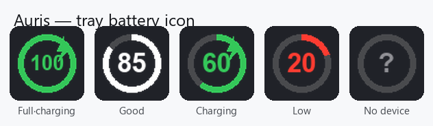

<div align="center">

# 🎧 Auris

**Um companheiro open-source para AirPods e fones Bluetooth no Windows e Linux.**

Veja a **bateria dos seus AirPods / Beats** — esquerdo, direito e case — direto
na bandeja do sistema. Uma alternativa livre e transparente a apps de código
fechado como o MagicPods.

[](LICENSE)
[](#-download)
[](https://www.python.org/)
[](https://github.com/abrahao-dev/auris/releases/latest)
[](https://github.com/abrahao-dev/auris/actions/workflows/ci.yml)
[](https://github.com/abrahao-dev/auris/releases)
[](CONTRIBUTING.md)

[English](README.md) · **Português (Brasil)**


<sub>Banner conceitual — o Auris de verdade vive na <b>bandeja do sistema</b>. UI real abaixo. 👇</sub>




</div>

> [!NOTE]
> O Auris apenas **escuta** os anúncios (advertisements) Bluetooth Low Energy que
> seus fones já transmitem. Ele nunca pareia, conecta, escreve ou envia dados
> para fora.

---

## ✨ Recursos

- 🔋 Porcentagem de bateria ao vivo: **esquerdo / direito / case**
- ⚡ Indicador de **carregamento** por componente
- 🎧 Funciona com **AirPods** (1–4, Pro, Pro 2, Max) e vários modelos **Beats**
- 🔔 Notificações de **bateria baixa** e de **conexão** (toast nativo no Windows, `notify-send` no Linux)
- 🖼️ Anel de bateria desenhado no **ícone da bandeja** para leitura rápida
- 🚀 Opção **iniciar com o sistema** (registro do Windows / autostart do Linux)
- ⏸️ **Auto-pausa** ao tirar os fones do ouvido — retoma ao recolocar *(experimental)*
- ⚙️ Menu **Configurações** no botão direito — ligue/desligue tudo, sem editar arquivo
- 🪟 **Windows** + 🐧 **Linux** (BlueZ) a partir de um único código em Python
- 🧾 Licença MIT, sem telemetria, código pequeno e legível

## 📥 Download

Baixe uma versão pronta pra usar na [**última release**](https://github.com/abrahao-dev/auris/releases/latest) — sem precisar de Python.

| Plataforma | Arquivo | Como executar |
|------------|---------|---------------|
| 🪟 **Windows 10/11** (instalador) | `AurisSetup.exe` | Execute — instalação por usuário, sem admin. Cria atalho no Menu Iniciar e opção de iniciar com o sistema. |
| 🪟 **Windows 10/11** (portátil) | `Auris.exe` | Dê dois cliques. O Auris aparece na bandeja do sistema. |
| 🐧 **Linux (x86-64)** | `auris-linux` | `chmod +x auris-linux && ./auris-linux` |

`winget install Abrahao.Auris` está a caminho — o manifesto está em
[`packaging/winget/`](packaging/winget/) aguardando publicação.

> O Windows pode exibir um aviso do SmartScreen porque o binário não é assinado
> digitalmente (é uma build open-source da comunidade) — clique em
> **Mais informações → Executar assim mesmo**, ou
> [compile você mesmo](#-rodando-a-partir-do-código-fonte).
>
> No Linux é necessário o BlueZ (`bluez`) e permissão para escanear BLE (estar no
> grupo `bluetooth` ou rodar com `sudo`). A bandeja precisa de um host
> StatusNotifier (no GNOME, instale a extensão *AppIndicator*).

## 🚀 Rodando a partir do código-fonte

```bash
git clone https://github.com/abrahao-dev/auris.git
cd auris
python -m venv .venv
# Windows:  .venv\Scripts\activate      Linux: source .venv/bin/activate
pip install -r requirements.txt

python -m auris          # app na bandeja
python -m auris --cli    # modo texto: imprime os anúncios decodificados no terminal
```

Requer Python 3.10+ e um adaptador Bluetooth LE.

## 🔬 Como funciona

Os fones da Apple transmitem continuamente um anúncio BLE sob o **company id
`0x004C`** (dado de fabricante da Apple). Dentro dele existe uma mensagem de
*proximity pairing* (tipo `0x07`) que codifica bateria, carregamento e estado da
tampa de forma aberta. O próprio sistema da Apple lê essa mesma transmissão; o
Auris apenas a decodifica de forma transparente.

```
payload de manufacturer_data[0x004C] (company id já removido):

  pos  valor  significado
  0    07     tipo da mensagem = proximity pairing
  3-4  ....   id do modelo, big-endian  (0E20 = AirPods Pro, 0A20 = AirPods Max, …)
  5    ..     byte de status — inclui o bit "flip" (qual fone é reportado primeiro)
  6    ..     bateria: nibble alto = fone A, nibble baixo = fone B
  7    ..     nibble alto = flags de carregamento, nibble baixo = bateria do case

  nibble de bateria: 0..10 -> ×10 por cento (10 = 100%);  0xF = indisponível
```

A tabela de ids de modelo em [`auris/models.py`](auris/models.py) foi conferida
com as pastas de assets que acompanham o MagicPods. Documentação completa em
[`docs/PROTOCOL.md`](docs/PROTOCOL.md).

## 🧱 Arquitetura

```
auris/
  protocol.py      Decodificador do Apple Continuity  ← o núcleo (com testes)
  models.py        tabela id do modelo → nome/família
  scanner.py       scanner BLE com bleak (WinRT no Windows, BlueZ no Linux)
  icon.py          renderizador do ícone (anel de bateria) com Pillow
  notifications.py toasts multiplataforma (winotify / notify-send / stdout)
  config.py        configuração JSON no perfil do usuário
  app.py           bandeja + rastreamento de estado + notificações (orquestrador)
tests/
  test_protocol.py testes do decodificador com anúncios montados à mão
```

O design espelha a própria divisão do MagicPods (um processo de UI conversando
com um serviço Bluetooth em segundo plano): aqui, uma thread daemon roda o
scanner BLE assíncrono e envia o estado decodificado para o loop do ícone da
bandeja na thread principal.

## 🧪 Desenvolvimento

```bash
pip install -r requirements.txt
python tests/test_protocol.py     # ou: pip install pytest && pytest
```

Gerar um binário standalone localmente:

```bash
pip install pyinstaller
pyinstaller Auris.spec             # saída em dist/
```

## ⚙️ Configurações

Clique com o botão direito no ícone da bandeja → **Settings**:

- **Start with system** — inicia o Auris ao logar (chave `Run` no Windows / `.desktop` no Linux)
- **Notify on connect** — notifica quando um dispositivo é detectado
- **Auto-pause (experimental)** — pausa a mídia quando os dois fones saem do
  ouvido e retoma quando voltam. Usa um sinal de in-ear de melhor-esforço vindo
  do anúncio BLE; a detecção robusta por fone precisa de uma sessão conectada,
  então vem desligada por padrão. No Linux usa `playerctl` (MPRIS) se instalado.

As configurações são salvas em um pequeno arquivo JSON no seu perfil de usuário.

## 🗺️ Planejamento (roadmap)

- [x] Auto-pausa por detecção no ouvido *(experimental)*
- [x] Iniciar com o sistema (autostart Windows / Linux)
- [ ] Detecção in-ear robusta via sessão AAP conectada
- [ ] Widget opcional do Windows 11
- [ ] Nomear dispositivos e UI para múltiplos aparelhos
- [ ] Builds do Windows assinadas digitalmente

## 🤝 Contribuindo

Contribuições de qualquer tamanho são bem-vindas — o decodificador é a parte
divertida e é pequeno. Bons pontos de entrada:

- 🐛 [Abra uma issue](https://github.com/abrahao-dev/auris/issues/new/choose) — reports de bug com a saída de `python -m auris --cli` valem ouro
- 🎧 Adicione um id de modelo em [`auris/models.py`](auris/models.py) se seu fone aparecer como *Unknown*
- 🌍 Melhore as traduções ([English](README.md) / Português)
- 🧪 Amplie os testes do decodificador em [`tests/test_protocol.py`](tests/test_protocol.py)

Leia o [CONTRIBUTING.md](CONTRIBUTING.md) para o fluxo de trabalho e observe o
[Código de Conduta](CODE_OF_CONDUCT.md). O histórico de versões está no
[CHANGELOG](CHANGELOG.md); reportes de segurança seguem o [SECURITY.md](SECURITY.md).

## 🙌 Créditos e trabalhos anteriores

O Auris se apoia na engenharia reversa aberta do protocolo Continuity da Apple
feita pela comunidade: [OpenPods](https://github.com/adolfintel/OpenPods),
[AirStatus](https://github.com/delphiki/AirStatus) e **LibrePods**. O MagicPods é
um app de código fechado, sem afiliação, referenciado apenas para pesquisa de
interoperabilidade. "AirPods", "Beats" e "MagicPods" são marcas de seus
respectivos donos; o Auris é independente e não é endossado por nenhum deles.

## 📄 Licença

MIT — veja [LICENSE](LICENSE).
